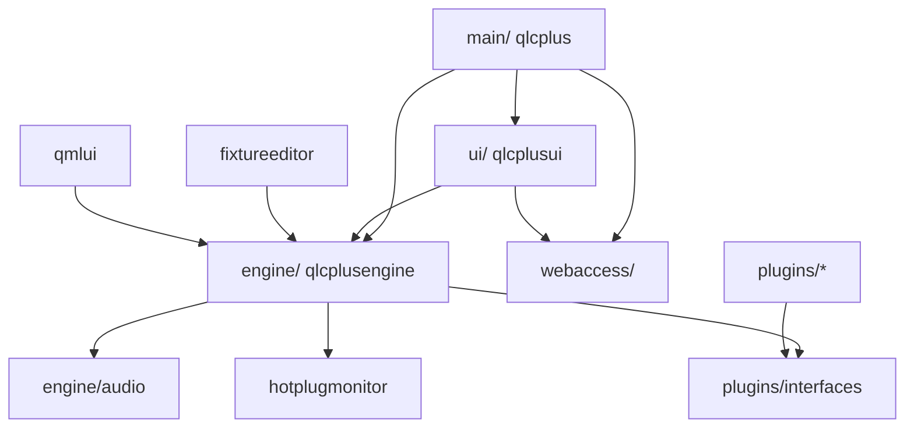

# AGENTS.md

Guidance for AI coding agents working in this repository.

## Scope restriction — TOTAL (read first)

The agent MUST only read and write files **inside this repository folder**
(`/Users/ericbafa/www/qlcplus-LEGACY`).

- **NEVER** create, edit, move or delete any file outside this folder — no
  exceptions, even when it looks related or necessary. This includes sibling
  repos such as `/Users/ericbafa/www/easy-artnet-interface`, Arduino libraries
  (`~/Documents/Arduino`, `~/Library/Arduino15`), system configs and the home dir.
- **NEVER** run state-changing commands outside this folder (e.g. `git checkout`
  in another repository, installs, or edits under `~`).
- **Reading** external files for context is allowed **only when the user
  explicitly asks for it**; writing is always forbidden.
- If a task seems to require changes outside this folder, **STOP and ask the
  user**. Provide the proposed external changes as text/patch in the response so
  the user can apply them manually.

## What this project is

**Q Light Controller Plus (QLC+)** — a cross-platform C++/Qt lighting-control application (DMX, Art-Net, sACN, MIDI, OSC, …). This checkout is the **LEGACY v4 branch** (QtWidget UI), a personal fork of `mcallegari/qlcplus` at `github.com/EricNakamura/qlcplus-LEGACY`, version `4.14.5 GIT`.

Read these first — do not duplicate their content:
- [README.md](README.md) — project overview, protocols, license.
- [CONTRIBUTING.md](CONTRIBUTING.md) — contribution rules. **Engine and `VCWidget` changes must be discussed before implementing.**
- [SUPPORT.md](SUPPORT.md) — support channels.
- Build guides: [GitHub Wiki](https://github.com/mcallegari/qlcplus/wiki). User docs: <https://docs.qlcplus.org/>.

## Build

**Never build in-source** — CMake hard-fails (`CMakeLists.txt`). Always use `build/`.

```bash
cd /Users/ericbafa/www/qlcplus-LEGACY
cmake -S . -B build -G Ninja \
  -DCMAKE_TOOLCHAIN_FILE=/opt/homebrew/lib/cmake/Qt6/qt.toolchain.cmake \
  -DCMAKE_BUILD_TYPE=Debug \
  -DCMAKE_OSX_DEPLOYMENT_TARGET=14.0
cmake --build build            # or: ninja -C build
```

- Active toolchain: **Qt 6.11.1 (Homebrew)**, Ninja, Debug. Qt5 and Qt6 are both supported by the source — keep new code compatible with both.
- **LuaJIT is a hard dependency in this fork** (`engine/src/CMakeLists.txt` calls `pkg_check_modules(LUAJIT REQUIRED luajit)` and `FATAL_ERROR`s without it). Install with `brew install luajit`.
- Default build is **QLC+ 4** (`qmlui=OFF`). Pass `-Dqmlui=ON` to build the QLC+ 5 QML UI instead.
- Useful targets: `ninja -C build run`, `run-fxe`, `check`, `coverage`, `translations`, `install`.
- `-Werror -Wextra -Wall` are enabled on Linux/Windows (not Apple) — warnings break those builds.

## Tests

Qt Test based. Tests need resources copied into the build dir, so **always run via the wrapper**, never raw binaries from the source tree:

```bash
./unittest.sh ui          # QLC+ 4 (default)
./unittest.sh qmlui       # QLC+ 5
ninja -C build check      # equivalent
```

- Engine tests: `engine/test/<class>/`; UI tests: `ui/test/<widget>/`; plugin tests: `plugins/<name>/test/`.
- Run a single test: `cd build/engine/test/scene && ./test.sh`.
- `CONTRIBUTING.md` requires `make check` to pass before a PR.

## Architecture



| Directory | Purpose |
|---|---|
| `engine/` | Core library `qlcplusengine` — no UI. `Doc`, `Fixture`, `Function`/`Scene`/`Chaser`/`EFX`/`RGBMatrix`, `MasterTimer`, `InputOutputMap`, `Universe`. |
| `engine/audio/` | Audio subsystem + decoder plugins. |
| `ui/` | QLC+ 4 QtWidget UI (`libqlcplusui`): `App`, `VirtualConsole`/`VCWidget`, `SimpleDesk`, managers. |
| `main/` | QLC+ 4 executable entry point. |
| `qmlui/` | QLC+ 5 QML UI (only with `-Dqmlui=ON`). |
| `fixtureeditor/` | Standalone fixture-definition editor. |
| `plugins/` | I/O plugins + `plugins/interfaces/` (the `QLCIOPlugin` contract). |
| `webaccess/` | Embedded HTTP server + web UI. |
| `hotplugmonitor/` | Cross-platform device hotplug detection. |
| `resources/` | Fixtures, gobos, input profiles, RGB scripts, icons, schemas. |
| `platforms/` | Per-platform packaging (`linux/`, `macos/`, `windows/`, `android/`, `ios/`). |

Key files: `engine/src/doc.h` (central document), `engine/src/function.h`, `engine/src/mastertimer.h`, `engine/src/inputoutputmap.h`, `plugins/interfaces/qlcioplugin.h`, `ui/src/app.h`, `ui/src/virtualconsole/vcwidget.h`.

## Conventions

Match the existing upstream QLC+ style — there is **no** `.clang-format`/`.editorconfig`; style is by convention.

- **Formatting**: 4 spaces, no tabs, **Allman braces** (opening brace on its own line). Constructor init lists use leading commas.
- **Naming**: classes `PascalCase` (often `QLC`/`VC` prefix); methods `camelCase`; members `m_camelCase`; statics `s_camelCase`; XML/settings keys `#define K...`; slots `slot...`.
- **Idioms**: `== true` / `== false` comparisons are intentional house style. `NULL` (legacy) and `nullptr` (newer) are both present. `Q_DISABLE_COPY(Class)` instead of `= delete`. Old-style `SIGNAL()`/`SLOT()` connects dominate the UI. `Q_ASSERT` for pointer/state checks. `qDebug() << Q_FUNC_INFO` for logging.
- **Headers**: include guards (`#ifndef FOO_H`), **never `#pragma once`**. Forward-declare Qt and engine classes. Wrap classes in `/** @addtogroup ... @{ */ ... /** @} */`. Every `.cpp`/`.h` starts with the Apache-2.0 license header (copy from any existing file).
- **Qt compatibility**: guard version-specific code with `#if QT_VERSION >= QT_VERSION_CHECK(6, 0, 0)`; use `QT_MAJOR_VERSION` in CMake.
- **i18n**: wrap user-visible strings in `tr()`, add `.ts` files to the module's `TS_FILES`, then run `./translate.sh update` and `./translate.sh release`.

## Adding an I/O plugin

1. Create `plugins/<name>/CMakeLists.txt` (`project(<name>)`, `add_subdirectory(src)`).
2. Create `plugins/<name>/src/CMakeLists.txt` following `plugins/artnet/src/CMakeLists.txt` (`set(module_name ...)`, `add_library(... SHARED)`, install to `${INSTALLROOT}/${PLUGINDIR}`).
3. Implement `<name>plugin.h/.cpp` inheriting `QLCIOPlugin` with `Q_OBJECT`, `Q_INTERFACES(QLCIOPlugin)`, `Q_PLUGIN_METADATA(IID QLCIOPlugin_iid)`. Override `init()`, `name()`, `capabilities()`, `pluginInfo()`.
4. Register with `add_subdirectory(<name>)` in `plugins/CMakeLists.txt` (respect the platform guards there).
5. Add `.ts` translations and `org.qlcplus.QLCPlus.<name>.metainfo.xml`.

Plugins are discovered at runtime by `engine/src/ioplugincache.cpp` via `QPluginLoader` — there is no central registry to edit.

## Fork-specific gotchas

This is **not vanilla QLC+**. Be aware before "fixing" things:

- **Hardcoded absolute paths** to the maintainer's machine exist in `CMakeLists.txt` and `platforms/macos/CMakeLists.txt` (`/Users/ericbafa/QLC+.app`, `/opt/homebrew/opt/qt/bin/macdeployqt`). These are intentional local build automation; don't assume they are portable.
- **Portuguese** appears in CMake messages/comments and in `engine/src/rgblua.*` (which also has a placeholder `Copyright (c) Seu Nome / Eric Nakamura LEGACY Fork` header). Leave as-is unless asked.
- **LuaJIT RGB scripts**: `engine/src/rgblua.*` adds a Lua engine alongside JS; `RGBScriptsCache` was changed to load `.lua` files and most `.js` scripts are commented out in `resources/rgbscripts/CMakeLists.txt`.
- Other fork features: global transition slider in the Virtual Console, Monitor "always on top", 50 Hz RGB timing, LTP flash fixes.
- `engine/src/qlcconfig.h` is **generated** — edit `qlcconfig.h.in` / `qlcconfig.h.noroot.in` instead.
- `APPVERSION` is `4.14.5 GIT` (`variables.cmake`) while the CMake project version is `4.14.4`.

## License

Apache License 2.0 — see [COPYING](COPYING). New source files must carry the standard Apache-2.0 header block. `check-licenses.sh` reports files with unrecognized headers (requires the `licensecheck` binary; not run in CI).
